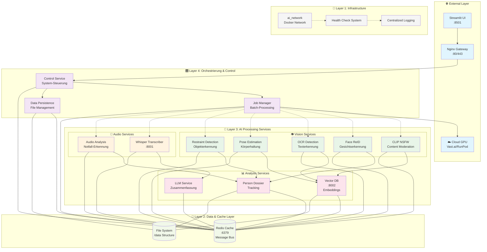
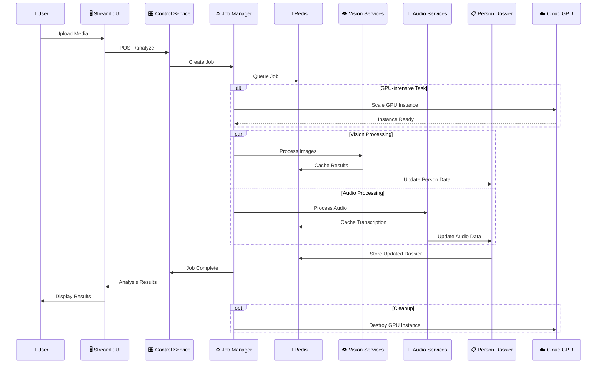
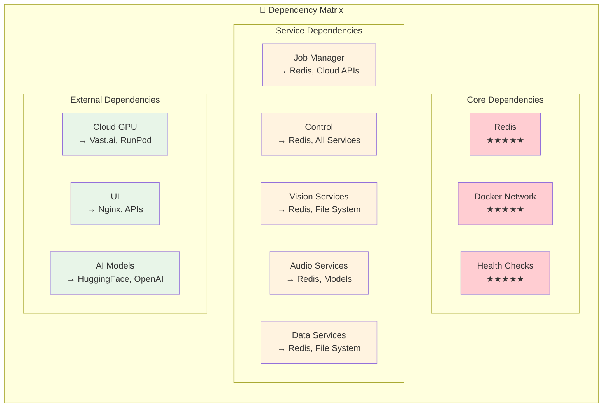
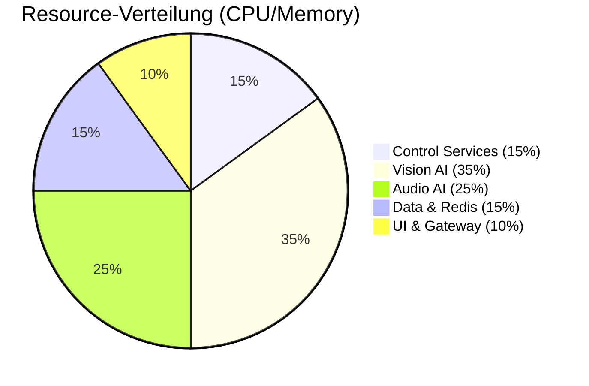
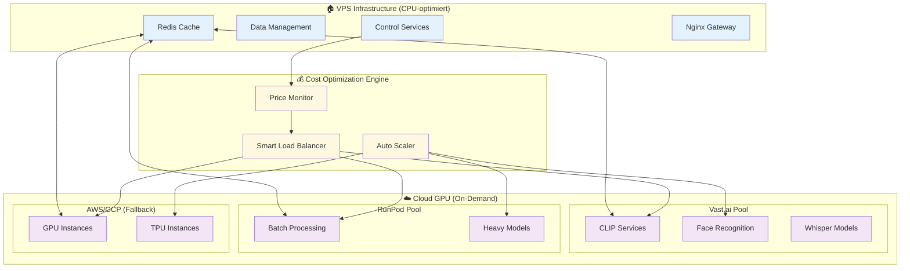
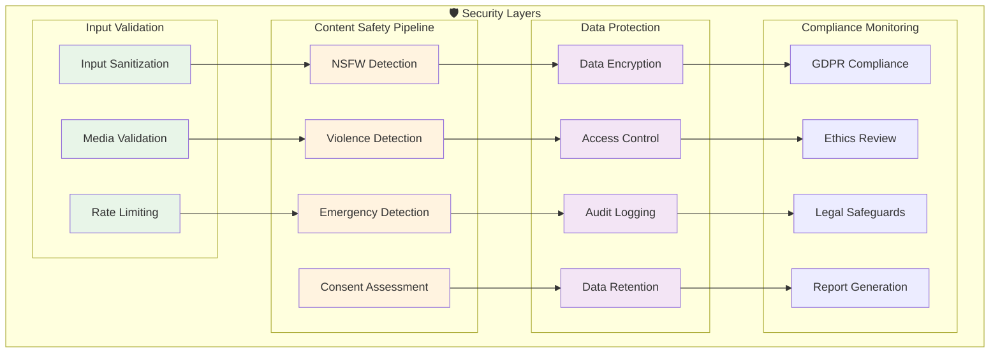
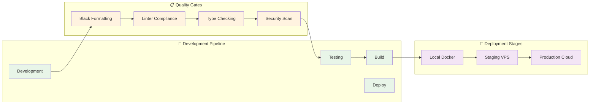

# AI Media Analysis System - Architektur-Diagramm

## System-Übersicht

Das AI Media Analysis System basiert auf einer **4-Schichten-Mikroservice-Architektur** mit Cloud-GPU-Integration für kostenoptimierte KI-Verarbeitung.

## Hauptarchitektur-Diagramm

## Datenfluss-Diagramm

## Service-Abhängigkeits-Matrix

## Resource-Allocation-Diagramm

## Cloud-Integration-Architektur

## Sicherheits-Architektur

## Entwicklungsarchitektur

---

## Architektur-Prinzipien

### 🎯 **Design-Philosophie**
1. **Microservice-First**: Jeder Service ist unabhängig deploybar
2. **Cloud-Native**: Hybrid VPS/Cloud für Kostenoptimierung
3. **Safety-by-Design**: Eingebaute Sicherheits- und Compliance-Checks
4. **Async-Everything**: Vollständig asynchrone Verarbeitung
5. **Resource-Aware**: Intelligente GPU-Nutzung und Auto-Scaling

### 🔄 **Skalierungs-Strategie**
- **Horizontale Skalierung**: Mehrere Service-Instanzen
- **Vertikale Skalierung**: Cloud-GPU für intensive Tasks
- **Cost-Optimization**: Dynamische Instanz-Verwaltung
- **Load-Balancing**: Intelligente Workload-Verteilung

### 🛡️ **Sicherheits-Konzept**
- **Defense-in-Depth**: Mehrschichtige Sicherheit
- **Principle of Least Privilege**: Minimale Berechtigungen
- **Zero-Trust**: Alle Verbindungen werden validiert

### 📊 **Monitoring & Observability**
- **Health-Checks**: Kontinuierliche Service-Überwachung
- **Centralized Logging**: Strukturierte Log-Aggregation
- **Metrics Collection**: Performance und Business-Metriken
- **Alerting**: Proaktive Benachrichtigungen bei Anomalien
