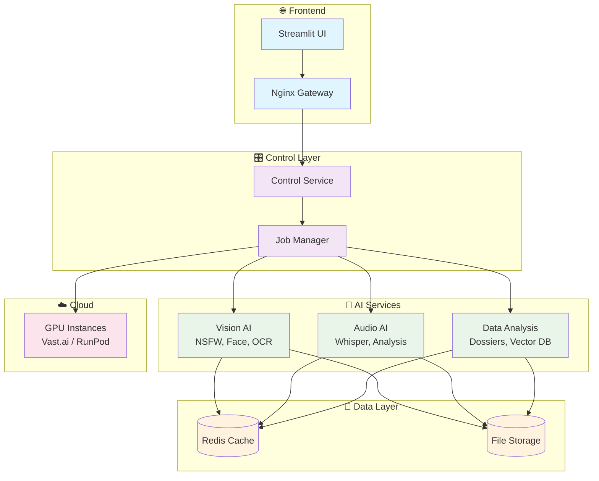
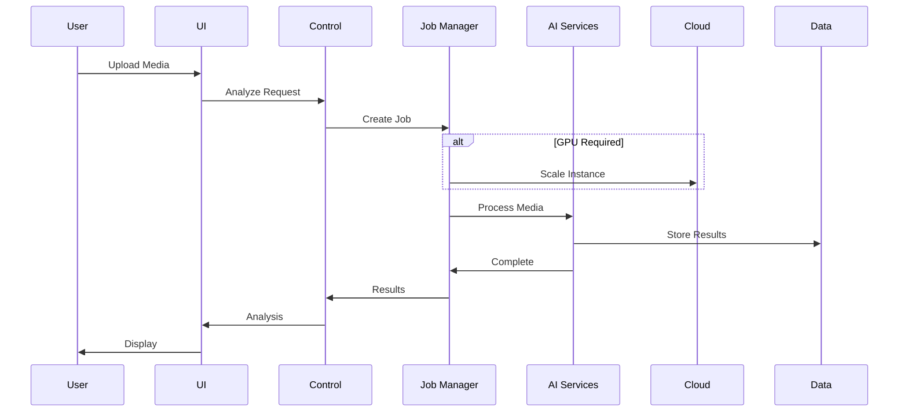
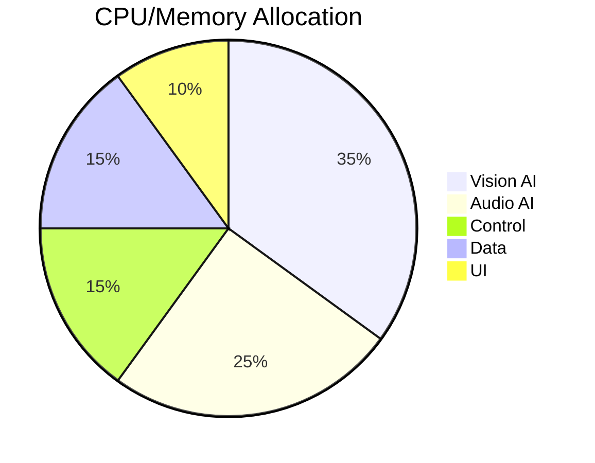

# AI Media Analysis - Vereinfachte Architektur

## System-Übersicht

## Datenfluss

## Service-Ports

| Service | Port | Beschreibung |
|---------|------|-------------|
| Nginx Gateway | 80/443 | HTTP/HTTPS Entry Point |
| Streamlit UI | 8501 | User Interface |
| Whisper | 8001 | Audio Transcription |
| Vector DB | 8002 | Embeddings Storage |
| Pose Estimation | 8003 | Body Analysis |
| Redis | 6379 | Cache & Message Bus |

## Resource-Verteilung

